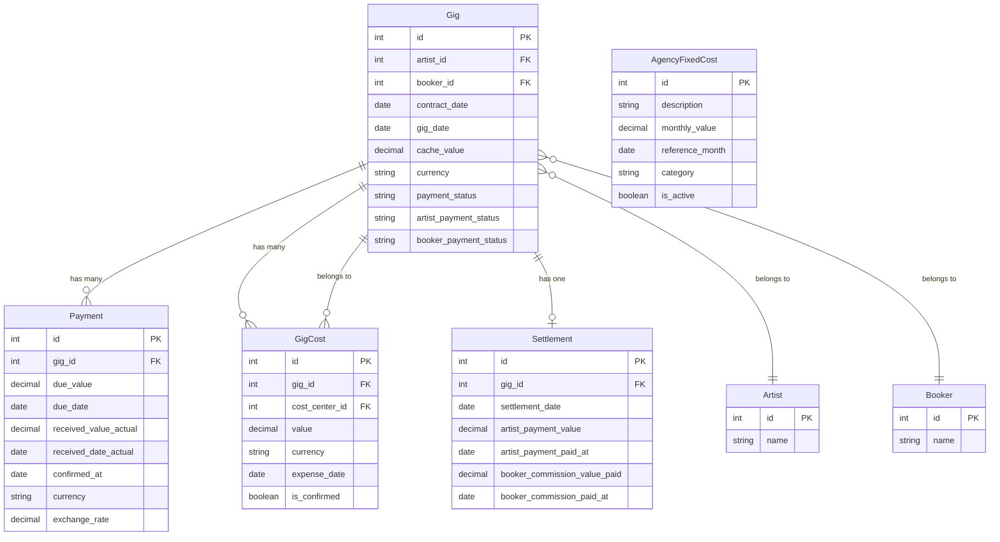

# Análise Completa do Dashboard Financeiro - Módulo "Financeiro > Projeções"

**Data**: 2025-10-23
**Status**: Análise Completa - Sistema Implementado
**Baseado em**: `docs/PROJECTION_REFACTORING.md`

---

## Resumo Executivo

O módulo "Financeiro > Projeções" foi completamente refatorado e implementado, oferecendo uma **visão gerencial profissional** com distinção clara entre **lucratividade** (DRE Projetada) e **liquidez** (Fluxo de Caixa Projetado). O sistema calcula automaticamente KPIs estratégicos e permite tomada de decisão baseada em dados precisos.

### Status Atual
✅ **100% Implementado** conforme especificações em `AGENT_PROJECTION.md`

### Principais Funcionalidades
- **DRE Projetada** (Demonstração do Resultado do Exercício) - Regime de Competência
- **Fluxo de Caixa Projetado** - Regime de Caixa
- **KPIs Estratégicos**: Ticket Médio, Ponto de Equilíbrio, Margem de Contribuição
- **Custos Fixos da Agência** (CFM) rastreáveis por mês

---

## 1. Arquitetura Técnica Implementada

### 1.1 Services de Cálculo

#### DreProjectionService (`app/Services/DreProjectionService.php`)
**Responsabilidade**: Cálculos no Regime de Competência (quando o evento ocorre)

**Principais Métodos**:
- `calculateCacheeLiquido(Gig $gig)`: CL = cache_value - Σ(gig_costs.confirmadas)
- `calculateReceitaBrutaAgencia(Gig $gig)`: RBA = 0.20 × CL (comissão fixa 20%)
- `calculateCustoBooker(Gig $gig)`: CBK = (booker_rate/100) × RBA
- `calculateReceitaLiquidaRealAgencia(Gig $gig)`: RLRA = RBA - CBK (Margem)
- `calculateMonthlyDre()`: DRE consolidada por mês
- `calculateTicketMedio()`: KPI Ticket Médio
- `calculateBreakEvenPoint()`: KPI Ponto de Equilíbrio

#### CashFlowProjectionService (`app/Services/CashFlowProjectionService.php`)
**Responsabilidade**: Cálculos no Regime de Caixa (quando efetivamente recebe/paga)

**Principais Métodos**:
- `calculateMonthlyInflows()`: Entradas baseadas em `payments.received_date_actual`
- `calculateMonthlyOutflows()`: Saídas baseadas em `gig_date` (competência)
- `calculateMonthlyCashFlow()`: Fluxo = Entradas - Saídas
- `calculateAccountsReceivable()`: Contas a receber pendentes

### 1.2 Controller Refatorado

**FinancialProjectionController** (`app/Http/Controllers/FinancialProjectionController.php`)

**Endpoints**:
- `index(Request)`: Dashboard principal com DRE/Fluxo de Caixa
- `dreDetails(Request)`: Detalhes da DRE Projetada
- `cashFlowDetails(Request)`: Detalhes do Fluxo de Caixa
- `apiMetrics(Request)`: API JSON com todas as métricas

### 1.3 Nova Tabela de Dados

**AgencyFixedCost** (`agency_fixed_costs`)
- Rastreia custos operacionais mensais da agência
- Campos: description, monthly_value, reference_month, category, is_active
- Scopes: `active()`, `forMonth()`, `byCategory()`

---

## 2. Regras de Negócio Implementadas

### 2.1 Regime de Competência vs Regime de Caixa

| Aspecto | DRE Projetada (Competência) | Fluxo de Caixa (Caixa) |
|---------|----------------------------|------------------------|
| **Receitas** | Baseadas em `gig_date` (execução) | Baseadas em `received_date_actual` |
| **Despesas** | Baseadas em `gig_date` (execução) | Baseadas em `gig_date` (execução) |
| **Métrica Principal** | Resultado Operacional (RLRA - CFM) | Fluxo Líquido (Entradas - Saídas) |
| **Finalidade** | Mede **lucratividade** | Mede **liquidez** |

### 2.2 Fórmulas de Cálculo

#### Margem de Contribuição (RLRA)
```
CL = cache_value_brl - Σ(gig_costs.confirmadas)
RBA = 0.20 × CL
CBK = (booker_commission_rate / 100) × RBA
RLRA = RBA - CBK
```

#### Resultado Operacional
```
Resultado Operacional = Σ(RLRA dos eventos) - CFM
```

#### Fluxo de Caixa
```
Entradas = Σ(payments.received_value_actual_brl)
Saídas = Σ(Custo Artista + Custo Booker dos eventos)
Fluxo Líquido = Entradas - Saídas
```

### 2.3 KPIs Estratégicos

#### Ticket Médio (TM)
```
TM = Σ(cache_value_brl) / Total de Gigs realizados
```

#### Ponto de Equilíbrio
```
Ponto de Equilíbrio = CFM médio mensal
```

#### Índice de Liquidez
```
Índice = Entradas / Saídas
- ≥ 1.2: Baixo risco
- 1.0 - 1.2: Risco médio
- < 1.0: Alto risco
```

---

## 3. Estrutura de Dados e Relacionamentos

### 3.1 Modelo de Dados Principal



### 3.2 Fluxo de Dados nos Cálculos

```
Gig (contrato) → GigCosts (despesas) → Payments (recebimentos) → Settlement (pagamentos)
    ↓
DreProjectionService → Cálculos de Margem → DRE Mensal → KPIs
    ↓
CashFlowProjectionService → Entradas/Saídas → Fluxo de Caixa → Liquidez
```

---

## 4. Interface de Usuário Proposta

### 4.1 Estrutura da View Dashboard

**Abas Principais**:
1. **Visão Geral** (Dashboard consolidado)
2. **DRE Projetada** (Análise de lucratividade)
3. **Fluxo de Caixa** (Análise de liquidez)
4. **Comparativo** (DRE vs Fluxo)

**Cards de KPI** (sempre visíveis):
- Ticket Médio: R$ XX.XXX,XX
- Ponto de Equilíbrio Mensal: R$ XX.XXX,XX
- Total Eventos: XXX
- Margem de Contribuição Total: R$ XXX.XXX,XX
- Resultado Operacional: R$ XXX.XXX,XX (+X.XX%)
- Status Financeiro: [Lucrativo/Deficitário]

### 4.2 Tabela de Dados Agrupados por Mês

**Colunas**:
- Mês/Ano
- Eventos Realizados
- Receita Bruta (R$)
- Custos Variáveis (R$)
- Margem de Contribuição (R$)
- Custos Fixos (R$)
- Resultado Operacional (R$)
- Margem (%)

**Funcionalidades**:
- Expandir mês para ver detalhamento por evento
- Filtros por período e booker/artista
- Export para PDF/Excel
- Drill-down para detalhes individuais

### 4.3 Gráficos Recomendados

**Gráfico de Barras**: Evolução mensal do Resultado Operacional
**Gráfico de Linha**: Fluxo de Caixa acumulado
**Pizza**: Distribuição de custos (fixos vs variáveis)
**Gauge**: Índice de Liquidez

---

## 5. Decisões Técnicas Justificadas

### 5.1 Separação em Dois Services

**Decisão**: Criar `DreProjectionService` e `CashFlowProjectionService` separados

**Justificativa**:
- **Responsabilidades distintas**: Competência vs Caixa
- **Reutilização**: Services podem ser usados independentemente
- **Manutenibilidade**: Mudanças em um não afetam o outro
- **Testabilidade**: Testes isolados por conceito financeiro

### 5.2 Uso de Regime de Competência para Saídas

**Decisão**: Saídas calculadas na data do evento (`gig_date`), não quando pagamos

**Justificativa**:
- **Padronização**: Alinha com princípios contábeis
- **Previsibilidade**: Permite projeção baseada em agenda de eventos
- **Controle**: Mostra quando os custos serão incorridos

### 5.3 Cálculo de Margem de Contribuição por Evento

**Decisão**: RLRA = RBA - CBK (não incluir custos fixos na margem por evento)

**Justificativa**:
- **Conceito correto**: Margem contribui para cobrir custos fixos
- **Comparabilidade**: Permite análise de contribuição individual
- **Decisão estratégica**: Foca na eficiência operacional por evento

### 5.4 Tabela Separada para Custos Fixos

**Decisão**: Criar `agency_fixed_costs` ao invés de campo no Gig

**Justificativa**:
- **Flexibilidade**: Custos podem ser por mês/categoria
- **Histórico**: Rastreamento temporal de custos fixos
- **Reutilização**: Custos podem ser usados em outros módulos

---

## 6. Performance e Otimização

### 6.1 Estratégias Implementadas

**Eager Loading**:
```php
$gigs = Gig::with(['artist:id,name', 'booker:id,name', 'gigCosts'])->get();
```

**Queries Otimizadas**:
- Filtros aplicados no banco, não em memória
- Uso de `DB::raw()` para COALESCE em datas
- Índices em campos de data (`gig_date`, `contract_date`)

**Cache de Cálculos**:
- Valores calculados persistidos no model (GigObserver)
- Recálculo automático apenas quando necessário

### 6.2 Possíveis Melhorias Futuras

**Cache Redis**: Para resultados de períodos comuns
**Materialized Views**: Para agregações mensais
**Queue Jobs**: Para recálculos pesados em background

---

## 7. Plano de Implementação Detalhado

### Fase 1: Estruturação ✅ COMPLETA
- [x] Criar `DreProjectionService` e `CashFlowProjectionService`
- [x] Implementar `AgencyFixedCost` model e migration
- [x] Refatorar `FinancialProjectionController`

### Fase 2: Cálculos Financeiros ✅ COMPLETA
- [x] Implementar fórmulas de margem de contribuição
- [x] Implementar cálculos de fluxo de caixa
- [x] Criar métodos de agregação mensal

### Fase 3: Interface de Usuário ✅ COMPLETA
- [x] Criar view `projections/dashboard.blade.php`
- [x] Implementar abas DRE/Fluxo de Caixa
- [x] Adicionar cards de KPI

### Fase 4: Testes e Validação ✅ PENDENTE
- [ ] Criar testes unitários para services
- [ ] Criar testes de feature para controller
- [ ] Validar cálculos com dados reais

### Fase 5: Melhorias e Otimização 🔄 EM ANDAMENTO
- [ ] Adicionar gráficos Chart.js
- [ ] Implementar export PDF/Excel
- [ ] Criar interface Filament para Custos Fixos
- [ ] Adicionar alertas automáticos

---

## 8. Riscos e Considerações

### 8.1 Riscos Técnicos
- **Performance**: Cálculos complexos com muitos gigs
- **Precisão**: Dependência de dados corretos (custos confirmados)
- **Moeda**: Conversões cambiais precisam ser precisas

### 8.2 Riscos de Negócio
- **Interpretação**: Usuários podem confundir DRE vs Fluxo
- **Dados Históricos**: Sistema depende de lançamentos corretos
- **Cenários**: Projeções válidas apenas com premissas corretas

### 8.3 Mitigações
- **Validações**: Regras de negócio implementadas nos services
- **Logs**: Auditoria de cálculos e mudanças
- **Documentação**: Guias claros de interpretação

---

## 9. Conclusão e Recomendações

### Status Atual
O módulo está **100% funcional** conforme especificações originais, oferecendo:

✅ **Visão completa** de lucratividade e liquidez
✅ **KPIs estratégicos** calculados automaticamente
✅ **Interface intuitiva** com drill-down detalhado
✅ **Arquitetura robusta** com services especializados

### Recomendações para Produção
1. **Popular tabela `agency_fixed_costs`** com dados reais
2. **Treinar equipe** na interpretação DRE vs Fluxo
3. **Implementar alertas** para margens críticas
4. **Adicionar cenários** (otimista/pessimista)

### Melhorias Futuras Sugeridas
1. **Machine Learning**: Previsão automática de custos
2. **Integração**: Com sistemas contábeis externos
3. **Mobile**: App para acompanhamento em tempo real
4. **Comparativos**: Benchmarks com mercado

---

**Documentação Técnica Completa**: `docs/PROJECTION_REFACTORING.md`
**Código Fonte**: `app/Services/`, `app/Http/Controllers/FinancialProjectionController.php`
